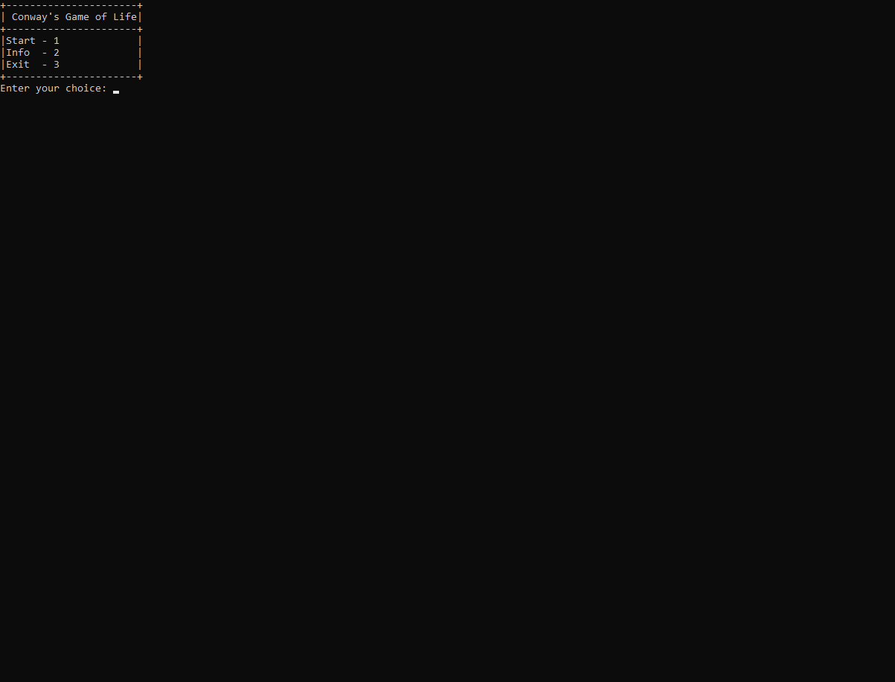

# Conway's Game of Life

> **IMPORTANT NOTE:** For the best visual experience, please **maximize your terminal/console window** (Full Screen) before starting the simulation. The grid requires a large display area to render correctly without line wrapping.

##  What is Conway's Game of Life?
**Conway's Game of Life** is a cellular automaton devised by the British mathematician John Horton Conway in 1970. It is a **zero-player game**, meaning that its evolution is determined by its initial state, requiring no further input. One interacts with the Game of Life by creating an initial configuration and observing how it evolves based on a set of mathematical rules regarding population density.
This project is a C++ implementation of Conway's Game of Life simulation.
##  Features
* **Custom Start Modes:** Includes Chaos, R-Pentomino, and Gosper Glider Gun patterns.
* **Speed Control:** Adjustable tick speed for simulation.
* **Optimized Rendering:** Smooth console output using string buffering.
* **Clean Code:** Built with OOP principles (Game & Creature classes).

##  How to Run

To run this project, you need a C++ compiler (like g++).
1. **Download or Clone the project:**
   ```bash
   git clone https://github.com/DavutEmirKoca/ConwaysGameOfLife.git
   ```
2. **Compile the Code:**
   ```bash
   g++ *.cpp -o ConwaysGameOfLife
   ```
3.  **Run the executable:**
    ```bash
    Windows: ConwaysGameOfLife.exe
    ```
    ```bash
    Mac/Linux: ./ConwaysGameOfLife
    ```


##  Demos
<table> 
<tr> 
<th width="50%">Gosper Glider Gun (Infinite Growth)</th> 
<th width="50%">Chaos (Random)</th> 
</tr> 
<tr> 
<td></td> 
<td></td> 
</tr> 
</table>